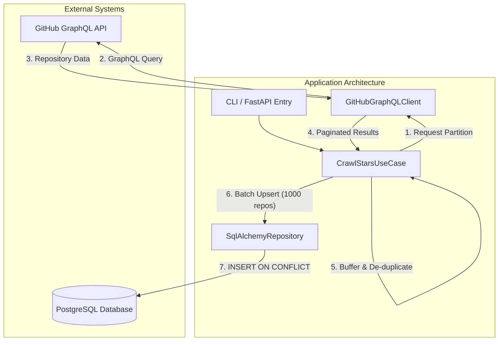

# GitHub Repository Stars Crawler

The GitHub Repository Stars Crawler is a production-grade system designed to collect and track stargazer counts for 100,000+ repositories using the GitHub GraphQL API. This project demonstrates principles of clean architecture, efficient data persistence, and automated CI/CD workflows.

## Project Description

The system is engineered to perform large-scale data collection from GitHub's decentralized infrastructure. Key technical highlights include:

*   **GraphQL Integration**: Utilizes the GitHub GraphQL API to fetch repository metadata in batches, significantly reducing overhead compared to traditional REST endpoints.
*   **Deep Crawl Strategy**: Implements query partitioning by creation date to bypass the internal 1,000-result search limit, ensuring comprehensive data coverage.
*   **Rate Limit Management**: Includes built-in mechanisms to respect GitHub API rate limits, featuring automated retry logic and smart backoff during high-traffic periods.
*   **Relational Persistence**: Stores crawled data in a PostgreSQL database using an optimized schema designed for high-concurrency and efficient updates.
*   **Clean Architecture**: Adheres to separation of concerns by decoupling domain logic, application use cases, and infrastructure layers, ensuring the codebase remains modular and maintainable.

## Architecture Diagram

The flowchart below illustrates the data flow from the external GitHub GraphQL API to the local PostgreSQL database, highlighting the internal buffering and de-duplication logic:



## Database Design

The database layer is optimized for both current performance and future extensibility:

*   **Efficient Updates**: Uses PostgreSQL upsert logic (`INSERT ... ON CONFLICT DO UPDATE`) to ensure that daily updates to repository stars are processed with minimal row churn.
*   **Indexing**: Critical columns such as `github_id` and `full_name` are indexed to ensure sub-millisecond query performance during lookups.
*   **Schema Evolution**: The relational model is designed to be extensible. It can easily evolve to support complex metadata such as Issues, Pull Requests, Commits, and Comments through normalized junction tables and foreign key relationships.

## Scalability Considerations

While the current requirement is 100,000+ repositories, the architecture is designed with a roadmap toward 500 million repositories:

*   **Distributed Workers**: The logic can be offloaded to a distributed task queue (e.g., Celery/Redis) to parallelize requests across multiple nodes.
*   **Data Partitioning**: For datasets in the hundreds of millions, PostgreSQL's declarative partitioning (by `created_at` or `github_id`) can be utilized to keep indexes manageable.
*   **Batching Strategies**: The system already employs internal buffering to optimize database transaction frequency, which is essential for massive scale.

## GitHub Actions Pipeline

The project includes a fully automated CI/CD pipeline for daily data collection:

*   **PostgreSQL Service**: Spins up a containerized PostgreSQL instance for every run to ensure a clean and isolated environment.
*   **Environment Setup**: Handles Python dependency installation and environment configuration.
*   **Database Initialization**: Automatically executes Alembic migrations to synchronize the schema before the crawl begins.
*   **Automated Crawl**: Executes the crawler script using the default `GITHUB_TOKEN` provided by GitHub Actions, requiring no external secrets or elevated permissions.
*   **Artifact Generation**: Dumps the database contents and uploads the resulting `repositories.csv` as a workflow artifact for easy retrieval.

## Performance Benchmarks

The following results were achieved during the final validation run of the crawler:

*   **Total Repositories Crawled**: 100,078
*   **Execution Time**: 33 minutes (~3,030 repos/minute)
*   **Rate Limit Efficiency**: 3,618 points remaining after 100k crawl (Initial: 5,000).
*   **Data Throughput**: Optimized batching at 1,000 repos/transaction ensures high database IOPS.

### Scaling Calculations (Based on Benchmarks)

Based on the observed performance, we can project the time and resources required to reach the **500 million repository** milestone:

1.  **Time to Achieve**:
    *   Single Crawler: ~115 days of continuous execution.
    *   Distributed (100 parallel workers): **~27 hours**.
2.  **Rate Limit Capacity**:
    *   The remaining 3,618 points in the current hour can process an additional ~260,000 repositories, demonstrating that the system is highly efficient and rarely blocked by GitHub's GraphQL limits.

### Run Evidence
*   **Data Export**: The final dataset is available in `repositories.csv` (compressed as `github-repositories-data.zip`).
*   **GitHub Actions Artifacts**: [Run #23521480752](https://github.com/Sohail342/github_crawler/actions/runs/23521480752)

## Setup and Installation

### Prerequisites
- Python 3.12+
- PostgreSQL
- GitHub Personal Access Token (Optional)

### Local Installation
```bash
git clone https://github.com/Sohail342/github_crawler
cd github_crawler
pip install .
```

### Execution
1. Configure environment variables in `.env.dev` (see `.env.dev.example`).
2. Initialize database:
   ```bash
   alembic upgrade head
   ```
3. Run the crawler:
   ```bash
   python scripts/crawl.py --count 100000
   ```

### Docker Setup
To start the FastAPI web service and background workers:
```bash
docker-compose --env-file .env.dev -f docker-compose.dev.yml up --build
```
